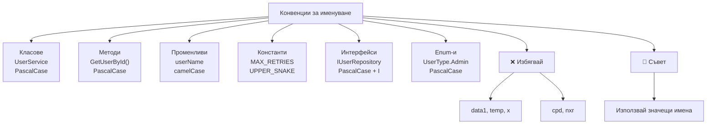

```mermaid
flowchart TD
    NamingConventions[Конвенции за именуване]
    
    NamingConventions --> Classes["Класове<br>UserService<br>PascalCase"]
    NamingConventions --> Methods["Методи<br>GetUserById()<br>PascalCase"]
    NamingConventions --> Variables["Променливи<br>userName<br>camelCase"]
    NamingConventions --> Constants["Константи<br>MAX_RETRIES<br>UPPER_SNAKE"]
    NamingConventions --> Interfaces["Интерфейси<br>IUserRepository<br>PascalCase + I"]
    NamingConventions --> Enums["Enum-и<br>UserType.Admin<br>PascalCase"]

    NamingConventions --> Avoid["❌ Избягвай"]
    Avoid --> BadNames1["data1, temp, x"]
    Avoid --> BadNames2["cpd, nxr"]

    NamingConventions --> Tip["🧠 Съвет"]
    Tip --> Meaningful["Използвай значещи имена"]
```
